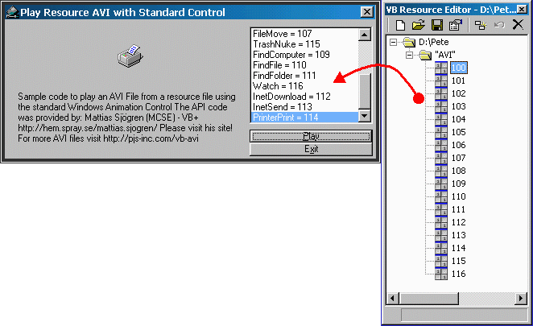



## AVI \- Play from RESource file using Standard Control

### Description

Purpose: play an AVI file that is stored in a resource file using the standard (Microsoft Windows Common Controls-2 6.0) Animation Control.

Credits:Mattias Sjögren (MCSE) - VB+ http://hem.spray.se/mattias.sjogren/ for the API code. For more AVI files visit http://pjs-inc.com/vb-avi
 
### More Info
 

             |
---                |---
**Submitted On**   |2000-06-12 12:33:40
**By**             |[Pete Sral](https://github.com/Planet-Source-Code/PSCIndex/blob/master/ByAuthor/pete-sral.md)
**Level**          |Intermediate
**User Rating**    |4.9 (34 globes from 7 users)
**Compatibility**  |VB 5\.0, VB 6\.0
**Category**       |[Custom Controls/ Forms/  Menus](https://github.com/Planet-Source-Code/PSCIndex/blob/master/ByCategory/custom-controls-forms-menus__1-4.md)
**World**          |[Visual Basic](https://github.com/Planet-Source-Code/PSCIndex/blob/master/ByWorld/visual-basic.md)
**Archive File**   |[CODE\_UPLOAD67076122000\.zip](https://github.com/Planet-Source-Code/pete-sral-avi-play-from-resource-file-using-standard-control__1-8865/archive/master.zip)

